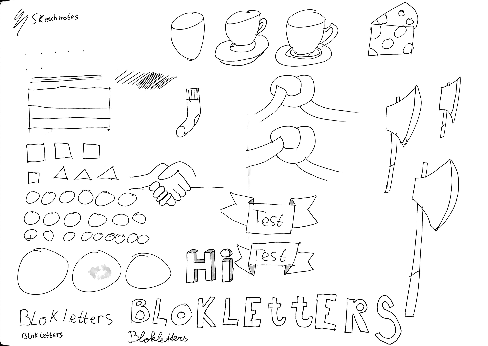
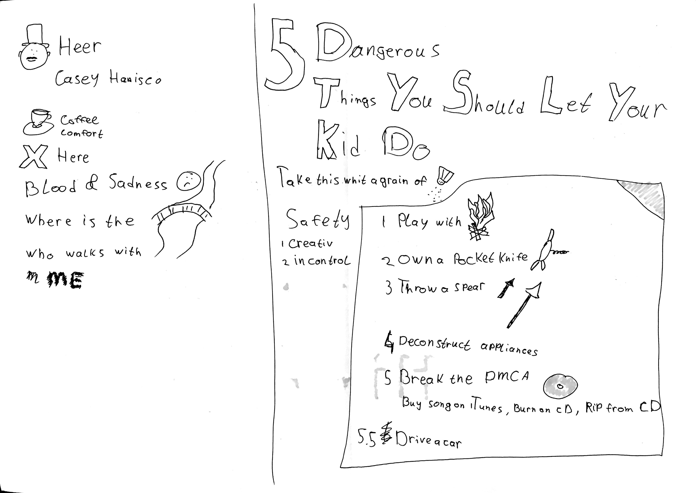
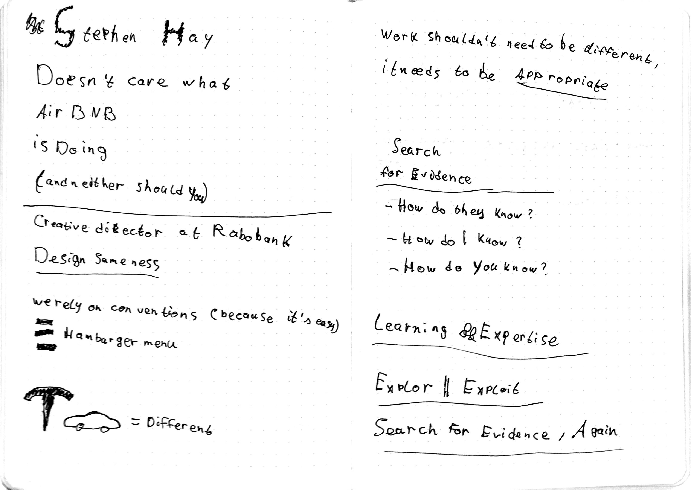
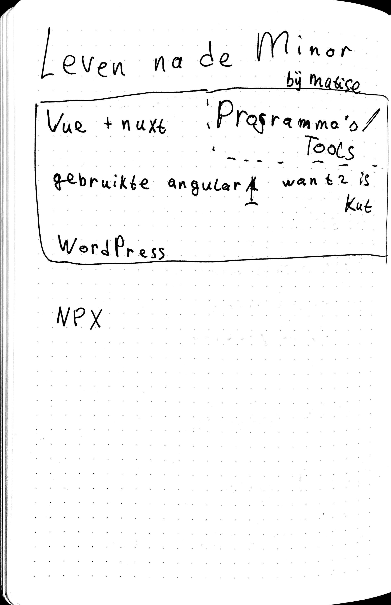
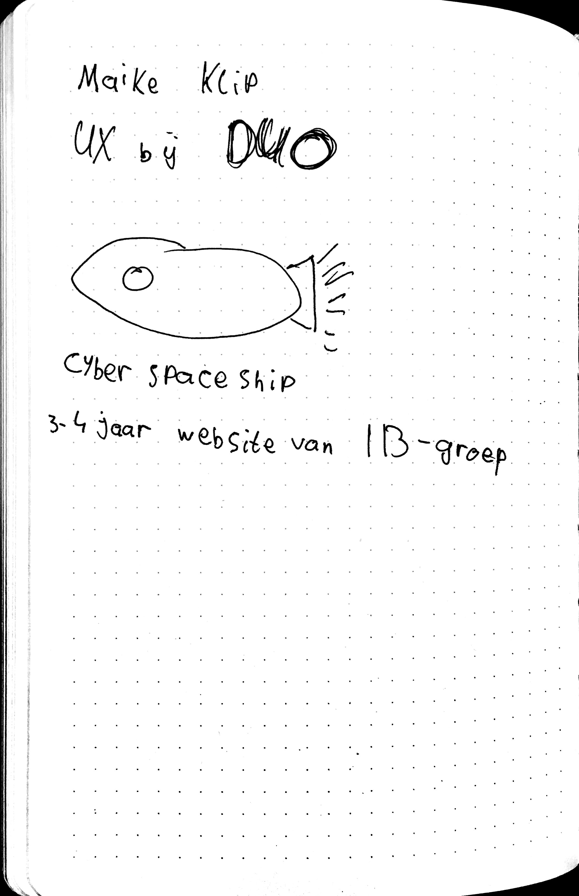
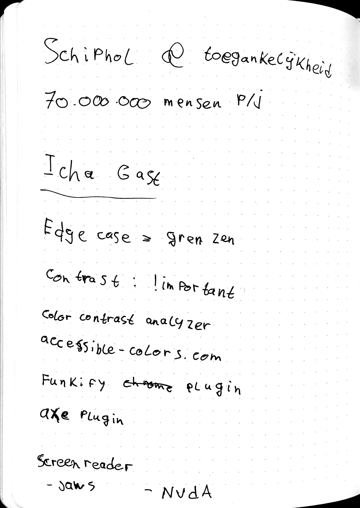

# Weekly Nerd @cmda-minor-web · 2018-2019
This repo contains all my work for the 'Weekly nerd', which consists of 6 lectures, summaries of visits to 9 companies in Amsterdam & Hilversum, and 3 articles I wrote.

## Table of contents
* [Weekly nerds](#weekly-nerds)
  * [Sketchnoting - Maaike van Cruchten](#Sketchnoting---Maaike-van-Cruchten)
  * [I don't care what Airbnb is doing - Stephen Hay](#I-don't-care-what-Airbnb-is-doing---Stephen-Hay)
  * [Life after the minor (web dev) - Matise](#Life-after-the-minor-(web-dev)---Matise)
  * [UX at DUO - Maike Klip](#UX-at-DUO---Maike-Klip)
  * [Schiphol & accessibility - Ischa Gast](#Schiphol-&-accessibility---Ischa-Gast)
  * [Workshop progressive enhancement - De Voorhoede](#Workshop-progressive-enhancement---De-Voorhoede)
* [Weekly mingles](#weekly-mingles)
  * [Elastique](#elastique)
  * [Valtech](#valtech)
  * [Mirabeau](#mirabeau)
  * [Q42](#q42)
  * [Matise](#matise)
  * [Icatt](#icatt)
  * [Lifely](#lifely)
  * [Dept](#dept)
* [Articles](#articles)
  * [Why to use async/await](articles/async-await.md)
  * [Using the browsers native WebSocket API](articles/native-websocket.md)
  * [Animating text based on audio amplitude with p5.js](articles/animated-subtitles.md)

## Weekly nerds
All of the 'weekly nerds' I attended to.  
The reason why not all of my notes are sketched is because I need to think of something to sketch fairly quickly and listen to the talk at the same time, and I am terrible at multitasking. So often I just write down the things I find intereseting / valuable instead of sketching it.

### Sketchnoting - Maaike van Cruchten

Sketchnotes

In this talk Maaike spoke about why we should sketchnote. Spoiler: you remember your notes better because you actively thought about the notes. It is also more fun to revisit your notes.  
At the end we got a little workshop on how to sketchnote ourselves. The sketchnotes above are from that workshop.

### I don't care what Airbnb is doing - Stephen Hay

Sketchnotes

Stephen talked about the question 'Can't we do something like this?', where this is referring to some design thing another company is doing.  
In short, yes and no. We should only be doing (desinging) things if they are appropriate for product you are working on.  
This talk made me rethink [my portfolio website](https://jeroenvanberkum.nl), which was work in progress at that time.

### Life after the minor (web dev) - Matise

Sketchnotes

They talked about their tech stack. How it's set up. And they demoed how easy it is to create a new application with it. 

### UX at DUO - Maike Klip

Sketchnotes

Maike Klip does UX at DUO. She showed one of the first iterations of DUO.nl, which included some form of a spaceship.  
She also talked extensively about how connected people are to DUO.

### Schiphol & accessibility - Ischa Gast

Sketchnotes

Ischa Gast puts in a lot of effort to make the schiphol website accessible for everyone. He works a lot on edge cases, because he thinks that if you don't, you don't care about that user.  
After his talk a visually impaired person demonstrated how he uses a computer and browses the web using [jaws](screenreader-link-here). This was really interesting to see as I had never seen a visually impaired person browse the web before.

### Workshop progressive enhancement - De Voorhoede
This was a workshop, so I didn't make any sketchnotes.  
We first got a little talk about the concept of progressive enhancement, and why it's important. Little new information was told because we had already been thought about the concept in class (browser technologies).  
Then we formed small groups, picked a feature and designed the functionality progressively enhanced. HTML first, then styling using CSS, and then all the bells and whistles using JavaScript.

### Graduating and keeping you own signature - Daan Rongen
I didn't attend to this weekly nerd. <!-- I went windsurfing. The best way to clear my head.  -->

## Weekly mingles
All of the companies I visited during the 'weekly mingles'.

### Elastique
We first got an introduction about Elastique and what they do (front-end, back-end, design, you name it).  
Then we talked about the so called 'marshmellows' in projects. 'Marshmellows' are features that look fairly easy in the beginning, but turn out to be a lot more difficult than initially thought.  
Lastly we talked about the things an intern does at Elastique.

### Valtech
We first got a small tour around their office. Then we sat down and talked about the projects they do for pon, easyjet (holidays) and others. Their design team first creates a design and then makes a 'storybook' which the front-enders use to create components.

### Mirabeau
Upon arrival we got a tour of their 2 story office space (which is pretty massive). Then we sat down and spoke about how their projects are set up. Later we discussed how far they would go to make a website accessible. Spoiler: depends on the project. I also showed them the contrast checker that is built in in the chrome dev tools. 

### Q42
When we arrived we were greeted by some fresh paintwork. They were redoing the walls.  
When we sat down they first introduced Q42. They told us what kinds of projects they do, how they are done, and what tech stack they use. Which depends on the project. They also have a bigger office situated in Den Haag.  
Furthermore, they have a few small label which develop products in house. They even have a small gamestudio.  
Last but not least we talked about why we all (them too) have chosen CMD. I also showed them my [windsurf-stats](https://github.com/jeroentvb/windsurf-stats) application.

### Matise
Matise is a fairly small company situated next to Artis. They mainly work with nuxt which makes development very easy for them.  
At the end we were given a task to think about how we could improve the concept for a tourist website for the province of Limburg.

### Icatt
At Icatt we sat down with the owner, a back-end developer, a front-end developer and a (ux) designer. It was cool to hear from each one of them what they do at Icatt.  
They showed a few of their projects, which were mostly for very formal entities, such as the municipality, foundations and pension funds.  

### Lifely
At lifely we first talked about the way they handle and plan projects. They work scrum-ish; scrum with their own twists. This was quite a lenghthy explaination.  
Next we spoke about their tech stack which consists of react, typescript and graphql. We also got an in depth explaination of how typescript works.

### Dept
Rondleiding begane grond. Flexplekken. Gehad over bedrijf en hoe het werkt (borrels, uitjes etc). Vooral gehad over wat een moet kunnen. 

Voelde als een reclamepraatje voor een stageplek bij dept

Upon arrival we first got a small tour of the ground floor of their office. Then we sat down in one of their meeting rooms. They spoke about what they expect from an intern and how the company works. They also told us that they organize a lot of events and trips with the whole company. We also talked a little about the minor and how we work.  
At the end we also received a small tour of the first floor.

## Articles
* [Why to use async/await](articles/async-await.md)
* [Using the browsers native WebSocket API](articles/native-websocket.md)
* [Animating text based on audio amplitude with p5.js](articles/animated-subtitles.md)